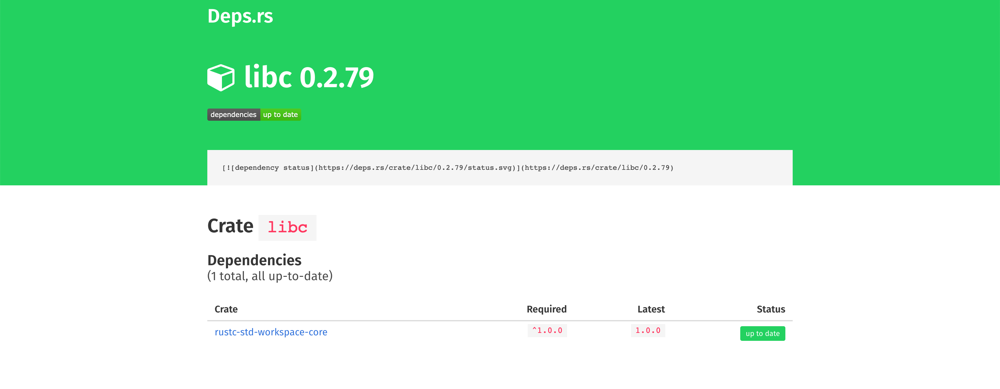

# Deps.rs - Dependency status at a glance

[](https://deps.rs/repo/github/deps-rs/deps.rs)
[](https://github.com/deps-rs/deps.rs/blob/master/LICENSE)



Deps.rs is a service that shows you at a glance if any of your dependencies are out of date or insecure.
This works by comparing the dependencies in a project's `Cargo.toml` to the latest versions in the crates.io database.
For security-related information, we query the RustSec Security Advisory Database.

We currently support projects and crates hosted on crates.io, Github, Gitlab, Bitbucket, and SourceHut.
To analyze the state of your dependencies you can use the following URLs:

- for projects on crates.io: `https://deps.rs/crate/<NAME>`
- for projects on Github, Gitlab, Bitbucket, SourceHut, Codeberg, or Gitea: `https://deps.rs/repo/<HOSTER>/<USER>/<REPO>` (where `<HOSTER>` is either `github`, `gitlab`, `bitbucket`, `sourcehut`, `codeberg`, or `gitea/<DOMAIN>`)

## Badges

On the analysis page, you will also find the markdown code to include a fancy badge in your project README so visitors (and you) can see at a glance if your dependencies are still up to date!

For crates on crates.io, you can use either:
- latest release: `https://deps.rs/crate/<NAME>/latest/status.svg`
- pinned version: `https://deps.rs/crate/<NAME>/<VERSION>/status.svg`

Use `latest` for a moving badge, or `<VERSION>` for a fixed release.

Badges have a few options, specified with query parameters:
- `style`: which matches the styles from `shields.io`:
  - `?style=flat` (default)
  - `?style=flat-square`
  - `?style=for-the-badge`
- `subject`: customize the text on the left (which is the same concept as `label` in `shields.io`, and [URL-Encoding](https://developer.mozilla.org/en-US/docs/Glossary/percent-encoding) is needed for spaces or special characters!). e.g.:
  - `?subject=yourdeps`
  - `?subject=git%20deps`
  - `?subject=deps%3Acore`

## Contributing

We are always looking for help from the community! Feel like a feature is missing? Found a bug? [Open an issue](https://github.com/deps-rs/deps.rs/issues/new)!

Do you want to contribute? Then browse the [list](https://github.com/deps-rs/deps.rs/issues) of open issues and ask if you can take care of it.

## Building the project

To get started on the project simply clone the repository and run the build:

```
git clone https://github.com/deps-rs/deps.rs
cd deps.rs
cargo run
```

The started development server will listen on port 8080 on localhost, so you just have to point your browser to `http://localhost:8080` to see if it works.

## Copyright and License

Copyright 2018 Sam Rijs and Contributors

Licensed under the Apache License, Version 2.0 (the "License").
You may obtain a copy of the License at

    http://www.apache.org/licenses/LICENSE-2.0

Unless required by applicable law or agreed to in writing, software
distributed under the License is distributed on an "AS IS" BASIS,
WITHOUT WARRANTIES OR CONDITIONS OF ANY KIND, either express or implied.
See the License for the specific language governing permissions and
limitations under the License.
